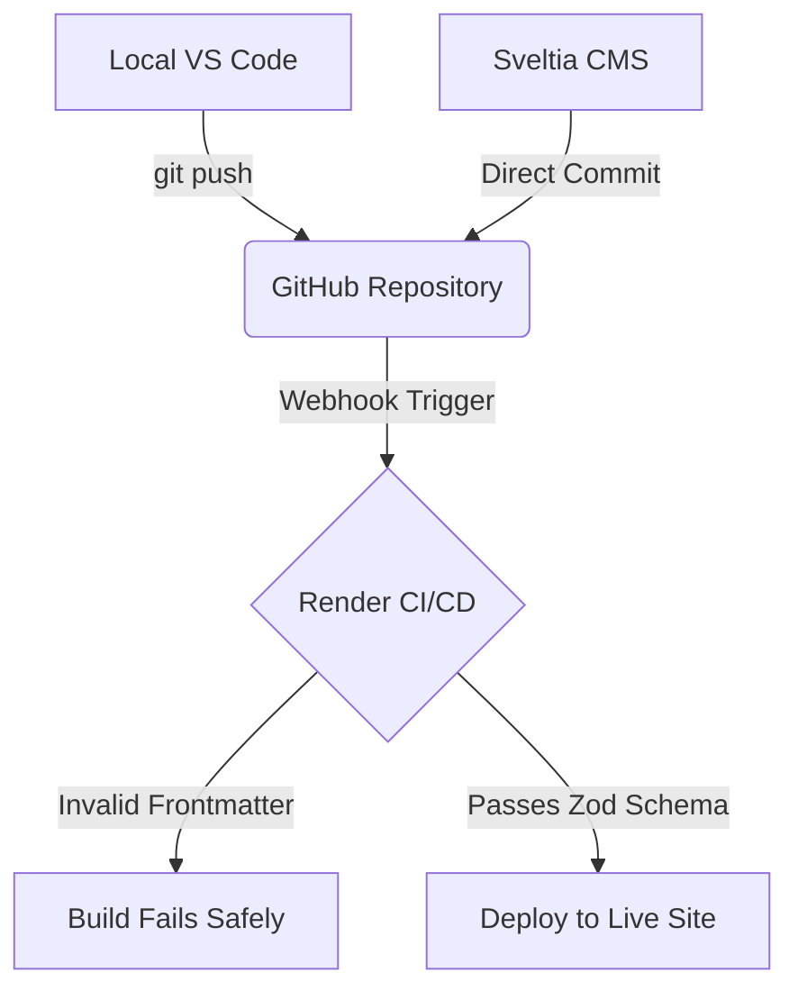

import { Aside, Steps } from '@astrojs/starlight/components';

Static images of architecture flows get outdated the moment you push a code change. To keep our documentation living and breathing, this site utilizes **Mermaid.js** integrated directly through `astro-mermaid`. 

Instead of opening a design tool like Figma or Visio, our diagrams are written as pure text, version-controlled in Git, and compiled into responsive SVGs at build time.

## How to Write a Mermaid Diagram

To render a flowchart, wrap your syntax inside a standard Markdown code block and label the language as `mermaid`. 

<Steps>
1.  **Define the Direction:** 
    Start your block by declaring the layout flow (e.g., `graph TD` for Top-to-Down, or `graph LR` for Left-to-Right).
2.  **Declare Your Nodes:**

    Give each node a unique letter identifier and wrap its display text in the appropriate shape brackets:

    *   `A[Square Box]` for standard components.
    *   `B(Rounded Pill)` for entry/exit points.
    *   `C{Diamond}` for conditional decision gates.

3.  **Connect the Flow:**
    Use arrows (`-->`) and optional text pipes (`-->|action|`) to map out the system logic.
</Steps>

## Example: The Publishing Pipeline Source Code

Here is the exact code block used to render the publishing architecture diagram you see on our governance page:

