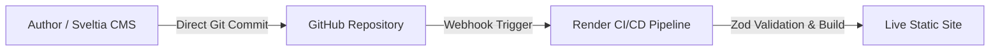

import { Aside, Steps } from '@astrojs/starlight/components';

A **Docs-as-Code** system combines static site generation, version control, and continuous integration to build high-performance documentation websites out of plain-text Markdown files.

## The Modern Jamstack Toolchain

* **Astro:** The high-speed frontend compiler that transforms raw Markdown and MDX into zero-JS static HTML.
* **Starlight:** The specialized documentation framework built on Astro providing built-in search, dark mode, and sidebar navigation.
* **Sveltia CMS:** A lightweight, headless visual CMS that commits directly to GitHub without requiring a database backend.
* **Mermaid.js:** A text-to-diagram engine that compiles chart syntax into responsive SVG architecture diagrams at build time.
* **GitHub & Render:** The version control vault and automated CI/CD pipeline responsible for building and deploying the site.

## High-Level Execution Flow

