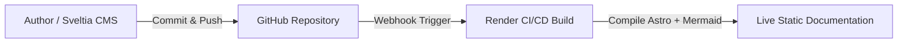

import { Aside, Steps } from '@astrojs/starlight/components';

A **Docs-as-Code** website treats your written documentation with the exact same rigor, version control, and automated testing as professional software code. Instead of using a traditional locked-down database CMS like WordPress, every page is a plain text file living safely in a version-controlled repository.

## The Tech Stack At-a-Glance

* **Astro:** The high-speed website engine that compiles markdown text files into blazing-fast static HTML.
* **Starlight:** The specialized documentation framework built on Astro that provides sidebar navigation, search, and dark/light themes out of the box.
* **Sveltia CMS:** The visual writing dashboard that connects directly to your file repository, giving authors a friendly editing interface without touching raw code.
* **Mermaid.js:** The plain-text diagramming engine that automatically converts code blocks into crisp vector architecture flowcharts at build time.
* **GitHub:** The central version control vault tracking every text change, revision history, and backup.
* **CI/CD (Render):** The automated quality gatekeeper that validates content schemas and publishes live updates in seconds.

## How the Pipeline Works Together

<Steps>
1. **Drafting:** You write or edit an article either visually using Sveltia CMS or directly as a markdown text file.
2. **Storage:** Saving your work commits the file to GitHub, ensuring every word is version-controlled and backed up.
3. **Validation & Build:** GitHub triggers Render to build the site; Astro compiles the markdown, Starlight styles it, and Mermaid renders your diagrams.
4. **Publication:** The finished, lightning-fast static pages go live on the web instantly.
</Steps>

## Architecture Flow

<Aside type="tip">
You don't need to be a software developer to contribute. Sveltia CMS lets you write naturally while the automated tech stack handles the heavy lifting behind the scenes!
</Aside>
